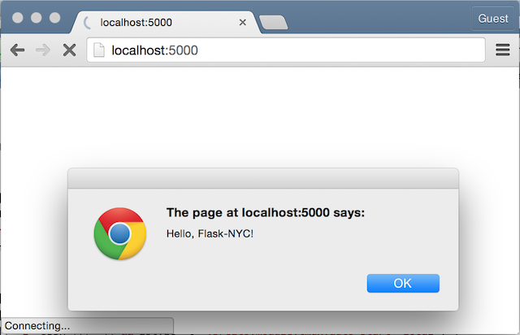
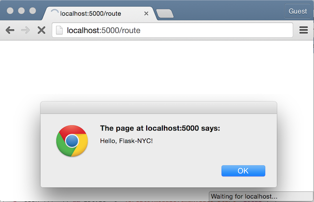
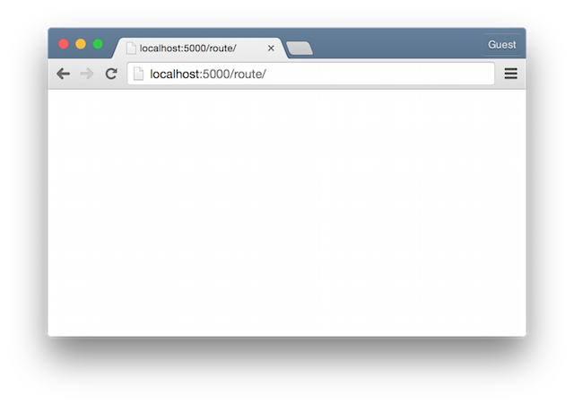
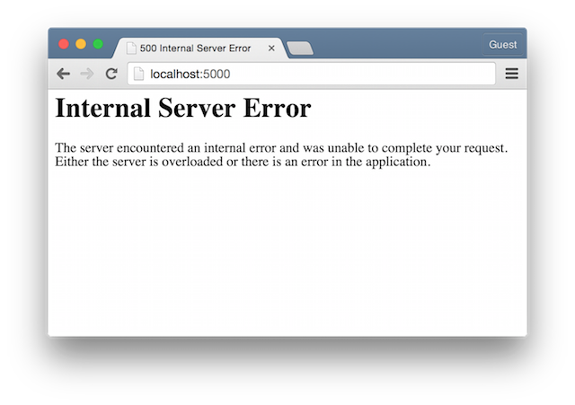

:title: Avoiding Common Flask Pitfalls
:css: hovercraft.css
:skip-help: true

----

Avoiding Common Flask Pitfalls
==============================

A talk by `@dirn <https://twitter.com/dirn>`_

----

.. image:: img/pitfall.jpg

----

So you want to use Flask
------------------------

----

You've come to the right place!

----

``pip install flask``

----

Application structure
---------------------

----

``myapp.py``

----

:class: has-code

.. code:: python

    from flask import Flask

    app = Flask(__name__)

    @app.route('/')
    def index():
        return 'Hello, Flask-NYC!'

    if __name__ == '__main__':
        app.run()

----

*This doesn't scale*

----

``myapp/__init__.py``

----

:class: has-code

.. code:: python

    from flask import Flask

    from myapp.views import *

    app = Flask(__name__)

----

``myapp/views.py``

----

:class: has-code

.. code:: python

    from myapp import app

    @app.route('/')
    def index():
        return 'Hello, Flask-NYC!'

----

``run.py``

----

:class: has-code

.. code:: python

    from myapp import app

    if __name__ == '__main__':
        app.run()

----

``ImportError: cannot import name 'app'``

----

**Circular import**

----

*The fix*

----

``myapp/__init__.py``

----

:class: has-code

.. code:: python

    from flask import Flask

    app = Flask(__name__)

    from myapp.views import * # Move this here.

----

Sometimes you want to spread your views across multiple files.

----

:class: has-code

.. code:: shell

    $ tree myapp/views
    views
    ├── admin.py
    └── frontend.py

----

``myapp/__init__.py``

----

:class: has-code

.. code:: python

    from flask import app

    app = Flask(__name__)

    from myapp.views.frontend import *

----

:class: has-code

.. code:: shell

    $ curl -I http://0.0.0.0/admin/
    HTTP/1.1 404 Not Found

----

*The fix*

----

Make sure you include all of your view files.

----

:class: has-code

.. code:: python

    from flask import app

    app = Flask(__name__)

    from myapp.views.admin import *
    from myapp.views.frontend import *

----

:data-rotate: 270

Forms
-----

----

``GET``

----

*Query String*

----

:class: has-code

.. code:: html

    <form action="..." method="get">
      <input name="name" value="value">
    </form>

----

.. code:: python

    assert request.args.get('value') == 'value'

----

``POST``

----

*Message Body*

----

:class: has-code

.. code:: html

    <form action="..." method="post">
      <input name="name" value="value">
    </form>

----

.. code:: python

    assert request.form.get('value') == 'value'

----

*Validation*

----

``pip install flask-wtf``

----

:class: has-code

.. code:: python

    form = SomeForm()
    if request.method == 'POST':
        if form.validate():
            do_something()

----

:class: has-code

.. code:: python

    form = SomeForm()
    if form.validate_on_submit():
        do_something()

----

*Multiple Forms*

----

:class: has-code

.. code:: html

    <form action="{{ url_for('handle_user') }}" method="post">
      <h3>Log in</h3>
      <input name="username">
      <input name="password">
    </form>

    <form action="{{ url_for('handle_user') }}" method="post">
      <h3>Register</h3>
      <input name="username">
      <input name="password">
      <input name="confirm_password">
    </form>

----

:class: has-code

.. code:: python

    form1 = LogInForm()
    form2 = RegisterForm()

    # Always checked, sometimes true.
    if form1.validate_on_submit():
        login_in_user()
    # Sometimes checked, never true.
    elif form2.validate_on_submit():
        register_user()

----

*The fix*

----

:class: has-code

.. code:: html

    <form action="{{ url_for('log_in_user') }}" method="post">
      <h3>Login</h3>
      <input name="username">
      <input name="password">
    </form>

    <form
      action="{{ url_for('register_user') }}" method="post">
      <h3>Register</h3>
      <input name="username">
      <input name="password">
      <input name="confirm_password">
    </form>

----

:data-rotate: 0

Static files
------------

----

``global.js``

----

.. code:: javascript

    alert('Hello Flask-NYC!');

----

:class: has-code

.. code:: python

    @app.route('/')
    @app.route('/index')
    @app.route('/index/')
    def index():
        return render_template('index.html')

----

``index.html``

----

.. code:: html

    

----

----

----

----

*The fix*

----

:class: has-code

.. code:: html

    

----

.. code:: html

    

----

What about dynamic JavaScript?

----

``global.js``

----

.. code:: javascript

    $.get({{ url_for('api.users') }});

----

``SyntaxError: Unexpected token {``

----

*The fix*

----

*Step one*

----

``global.js``

----

.. code:: javascript

    $.get(urlForUsers);

----

``template.html``

----

.. code:: javascript

    var urlForUsers = {{ url_for('api.users') }};

----

``SyntaxError: Invalid flags supplied to RegExp constructor 'users'``

----

**WAT?!**

----

.. code:: javascript

    var urlForUsers = /api/users;

----

*The fix*

----

*Step two*

----

.. code:: javascript

    var urlForUsers = '{{ url_for('api.users') }}';

----

.. code:: javascript

    var urlForUsers = '/api/users';

----

*The fix*

----

*Even better!*

----

.. code:: javascript

    var urlForUsers = {{ url_for('api.users')|tojson|safe }};

----

.. code:: javascript

    var urlForUsers = "/api/users";

----

:data-rotate: 270

Production errors
-----------------

----

----

*The fix*

----

**Check the logs**

----

:data-rotate: 0

Flask ecosystem
---------------

----

I want to learn how to do it...

----

I don't want another dependency...

----

Not Invented Here

----

``Flask-Security``
------------------

`pythonhosted.org/Flask-Security/ <https://pythonhosted.org/Flask-Security/>`_

----

``Flask-SQLAlchemy``
--------------------

`pythonhosted.org/Flask-SQLAlchemy/ <https://pythonhosted.org/Flask-SQLAlchemy/>`_

----

:data-rotate: 270

Internal requests
-----------------

----

:class: has-code

.. code:: python

    @app.route('/')
    def index():
        friends = requests.get(
            'http://localhost:5000/api/friends')
        return render_template('index.html', friends=friends)

    if __name__ == '__main__':
        app.run()

----

.. image:: img/loading.gif

----

**Single Threaded**

----

*The fix*

----

Application server

----

`uWSGI <https://uwsgi-docs.readthedocs.org/en/latest/>`_

`gunicorn <http://gunicorn.org/>`_

`mod_wsgi <https://modwsgi.readthedocs.org/en/master/>`_

----

:data-rotate: 0

Context is king
---------------

----

"I have a long running job that I want to run in the background."

----

"Use Celery"

----

``myapp/__init__.py``

----

:class: has-code

.. code:: python

    from flask_mail import Mail

    mail = Mail()
    mail.init_app(app)

----

``tasks.py``

----

:class: has-code

.. code:: python

    from myapp import mail

    @task
    def send_mail(msg):
        mail.send(msg)

----

``myapp/views.py``

----

.. code:: python

    send_mail.delay(msg)

----

``RuntimeError: working outside of application context``

----

*The fix*

----

.. code:: python

    mail = Mail(app)

----

:class: has-code

.. code:: python

    from myapp import app, mail

    @task
    def send_mail(msg):
        with app.app_context():
            mail.send(msg)

----

:data-rotate: 270

*Questions?*
