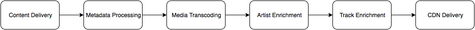
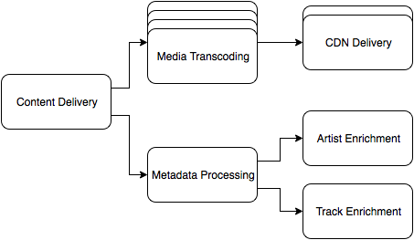

:title: Brought to You by the Letter H
:css: hovercraft.css
:skip-help: true

----

Brought to You by the Letter H
==============================

A talk by `@dirn <https://twitter.com/dirn>`_

----

This is Brian
-------------

.. image:: img/brian.jpg

----

Hi, Brian!

----

----

:data-rotate: -90

Metadata Processing
-------------------

----

Step 1: Find XML

----

Step 2: Transform XML

----

Step 3: Objectify XML

----

Step 4: Save data

----

:data-rotate: 0

http://dirn.it/ingestion-pipeline

----

.. image:: img/henson.png
   :target: https://henson.rtfd.org

`Henson <https://henson.rtfd.org>`_
===================================

----

Python 3.4+

----

``asyncio``

----

Open Source
-----------

Apache License, Version 2.0

----

Plugins
-------

----

`Henson-AMQP <https://henson-amqp.rtfd.org>`_
=============================================

----

`Henson-Database <https://henson-database.rtfd.org>`_
=====================================================

----

`Henson-Sentry <https://henson-sentry.rtfd.org>`_
=================================================

----

``henson.contrib``
------------------

----

`Henson-Retry <http://henson.readthedocs.org/en/latest/contrib/retry.html>`_
============================================================================

----

----

:class: has-code

.. code:: sh

    $ python -m pip install Henson

----

*Questions?*
